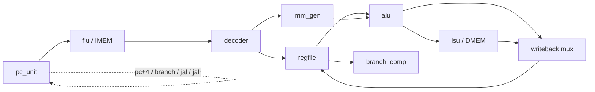

# RV32I CPU in SystemVerilog

From-scratch **RV32I** single-cycle RISC-V CPU — designed, unit-tested, and regression-tested in SystemVerilog (Vivado/XSim), with an asm→hex program flow and a Digilent **Cmod A7** FPGA top for bring-up.

---

## Highlights

- Full base **RV32I** datapath: ALU, regfile (`x0` hardwired), imm gen, decoder, branch comparator, PC unit, instruction fetch (`fiu`), load/store (`lsu`)
- Integrated single-cycle `rv32_core` with halt/trap on `ecall` / `ebreak`, illegal ops, and misaligned accesses
- **Unit tests** per module + core smoke, debug trace, and broad **regression** testbenches
- Assembly toolchain: `asm/*.S` → ELF/bin → `programs/*.hex` via `$readmemh`
- FPGA path: `src/cmod_a7_top.sv` + `constraints/cmod_a7_cpu_smoke.xdc` (LEDs show halt / pass / trap)

> Deep Vivado workflow, Tcl recipes, and troubleshooting live in **[docs/DEVELOPMENT.md](docs/DEVELOPMENT.md)**.

---

## Tech stack


-green)


---

## Datapath



Single-cycle control: decode once per instruction, execute ALU/memory/branch in the same cycle, write back, then advance PC.

---

## Quick start

### Requirements

- AMD/Xilinx Vivado (XSim)
- `riscv64-unknown-elf-gcc` / `objcopy` / `objdump`
- Python 3

```bash
sudo apt install gcc-riscv64-unknown-elf binutils-riscv64-unknown-elf python3
```

### Build a program image

```bash
./scripts/asm_to_hex.sh core_basic
# → build/core_basic.{elf,bin,dump} and programs/core_basic.hex
```

### Simulate (Vivado Tcl)

```tcl
cd <REPO_ROOT>
source refresh_sources.tcl
set_property top tb_alu [get_filesets sim_1]          ;# or tb_rv32_core / tb_rv32_core_regression
launch_simulation -simset sim_1 -mode behavioral
run all
```

See [docs/DEVELOPMENT.md](docs/DEVELOPMENT.md) for per-testbench commands, `$readmemh` path notes, and FPGA loading.

### FPGA smoke (Cmod A7)

1. Set `IMEM_INIT_FILE` on the core instance in `src/cmod_a7_top.sv` to your machine's path (or a path relative to the Vivado project) for `programs/core_basic.hex`.
2. Use `constraints/cmod_a7_cpu_smoke.xdc`.
3. **BTN0** = reset · **BTN1** = stall · **LED0** = halted · **LED1** = pass · RGB = trap / pass / reset.

Default program: `addi x1,5` / `addi x2,7` / `add x3,x1,x2` / `ebreak` — pass when halted at the expected `ebreak` with `x3 == 12`.

---

## Repository layout

```text
src/           synthesizable modules + cmod_a7_top.sv
sim/           unit, smoke, debug, and regression testbenches
asm/           RISC-V assembly sources
programs/      .hex images for $readmemh
scripts/       asm_to_hex.sh, bin_to_hex.py, linker.ld
constraints/   Cmod A7 pinout / clock
docs/          DEVELOPMENT.md (Vivado workflow)
build/         generated ELF/bin/dump
```

---

## Current scope / non-goals

Implemented for simulation and a minimal FPGA smoke test. **Not** included yet: external SRAM controller, UART / MMIO peripherals, CSRs beyond simple trap/halt, M or C extensions, pipelining, or official RISC-V compliance-suite integration.

---

## License / ISA notes

RISC-V is an open ISA. Design files in this repo are original work for portfolio / learning use. See also `riscv_isa_description.md` for an ISA-oriented write-up.
